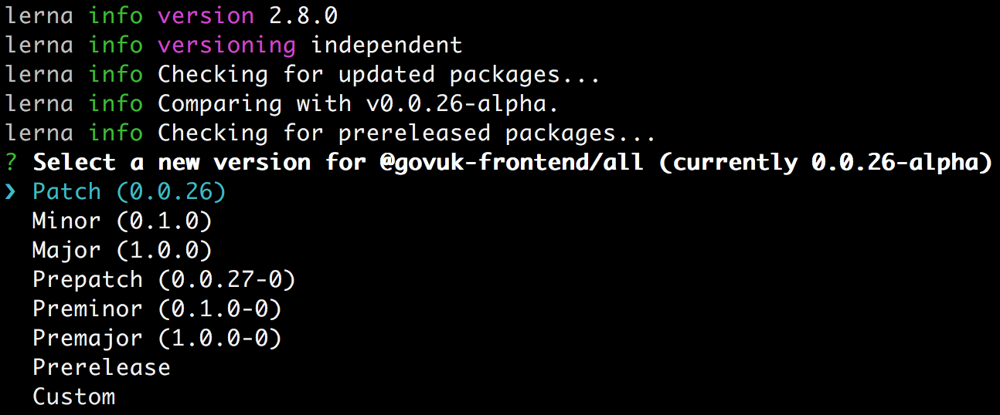
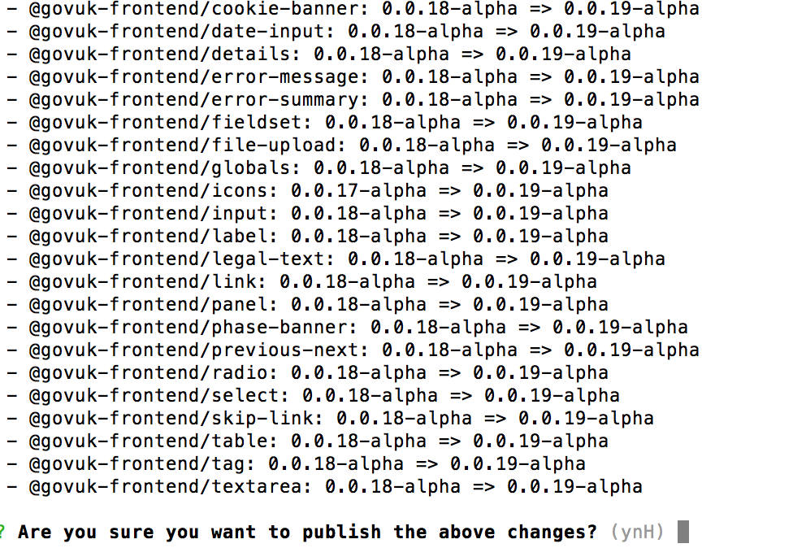

# Components

All components must use the `.govuk-` namespace and the `c` prefix.

For example, `.govuk-c-button`.

All components must follow the conventions described in our [CSS coding standards](coding-standards/css.md).

## Every component should:
* use classes for child elements, scoped to the parent component
* be flexible, not set a width or external padding and margins
* set internal margins in a single direction
* not rely on any other selector outside of the component scss file to style its children

## Component template API
[Read more](component-api.md) about the way we write component templates.

## Publishing components

We are using [lerna.js](https://lernajs.io/) to manage our packages and publish to npm.

Lerna is a tool that optimizes the workflow around managing multi-package repositories with git and npm.

It manages dependencies between our components so that if the version number of `globals` is bumped, all components dependent on `globals` will also have their version bumped.

### Publishing components manually (while in Alpha)

In a new branch:

1. Run the `npm run build:packages` task.

2. Ensure all changes to `src/components/component-name` have been copied to `packages/component-name`.

3. For any new components, add a `package.json` inside `packages/component-name`:
```
{
    "name": "@govuk-frontend/component-name",
    "version": "version-number",
    "dependencies": {
      "@govuk-frontend/globals": "version-number"
    }
}
```
Here, include any dependencies, such as the `icons` package, that the new component requires.

4. Include new components in `packages/all/package.json`.

5. Commit the changes to the updated packages
```
git add packages/*
git commit -m "chore(packages): copy changes to packages"
```

6. Open a pull request for these changes.

Once the PR has been merged into master:

1. Log in to `npm` as user who has permission to publish to the `govuk-frontend` scope.

2. Run
```
lerna bootstrap
```
This will install all package dependencies and link any cross-dependencies.

3. Run
```
lerna updated
```
This will display the packages that have changed.

4. Run
```
lerna publish -m "chore(release): update packages and publish"
```
Here, Lerna will prompt you to select the new version for each package. If you select
`minor`/`major` etc., Lerna will complete the version number for you. In private beta, we have selected `custom` and specified the new version number manually for each package
(see below):


5. Once you have updated all the package versions, confirm you want to publish the changes (see below).


Then in a new branch:

1. Update `dist` folder with the latest versions
```
npm run build:dist
```
```
git add dist/*
git commit -m "chore(dist): update dist to version x.x.x-alpha"
```

2. Open a pull request for these changes.


## Commit structure

This makes it easier to scan commit messages.

fix(button): amend button colour to meet contrast requirements


```
type(scope): short summary
long description
issue fixed
```

1. choose the [type of change](#commit-type)
2. add [scope for the change](#scope)
3. write a short summary
4. write a longer description
   list any breaking changes or issues fixed

### commit type:
- feat (new feature for the user, not a new feature for build script)
- fix (bug fix for the user, not a fix to a build script)
- docs (changes to the documentation)
- refactor (refactoring production code, eg. renaming a variable)
- style (formatting, missing semi colons, etc; no production code change)
- test (adding missing tests, refactoring tests; no production code change)
- chore (updating gulp tasks etc; no production code change)

### scope:
thing being changed - e.g. component name, packages, gulp
